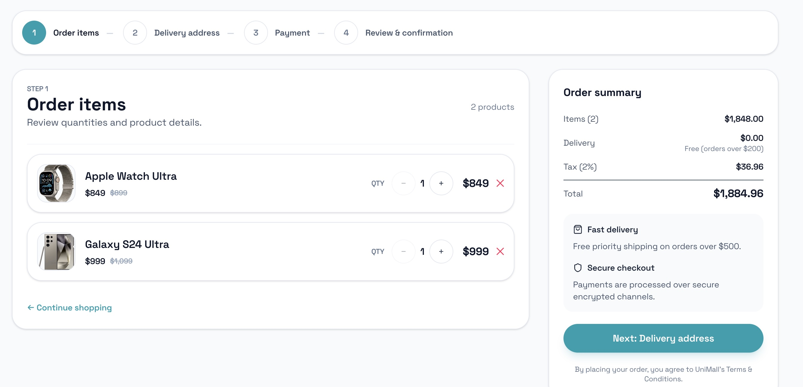
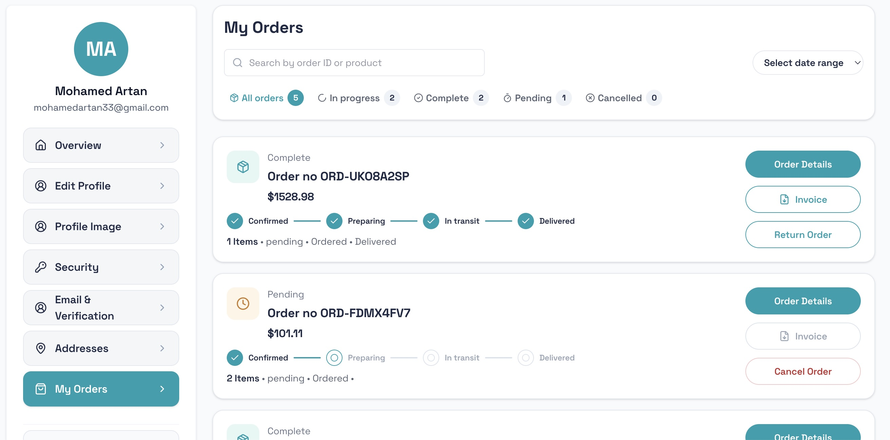
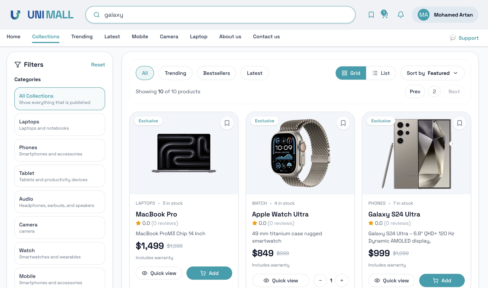
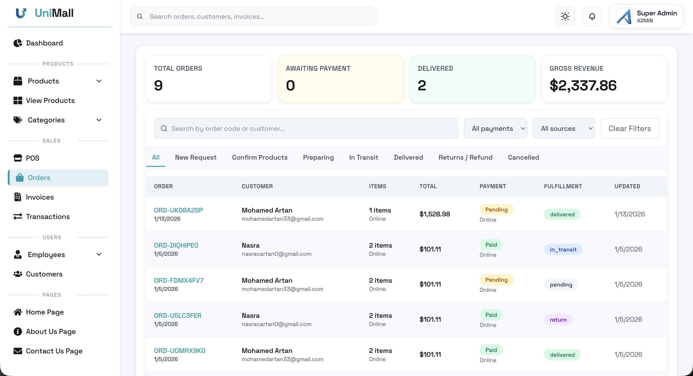
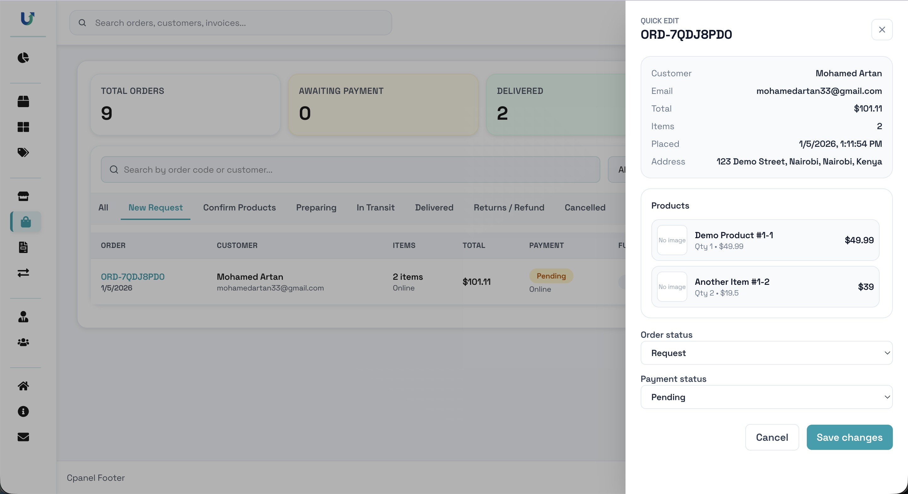
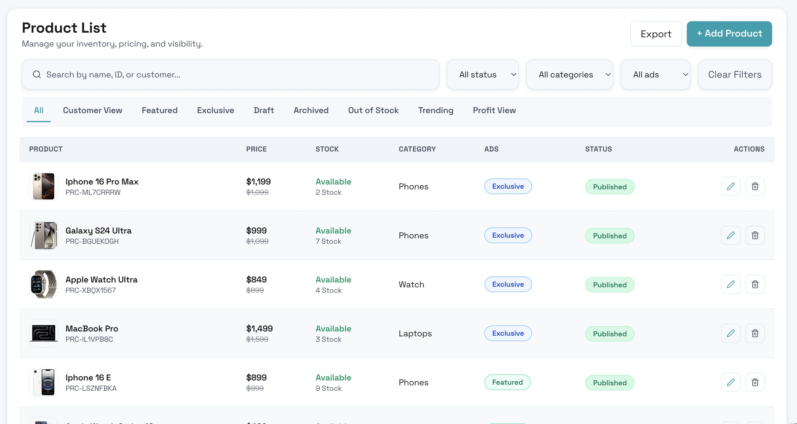
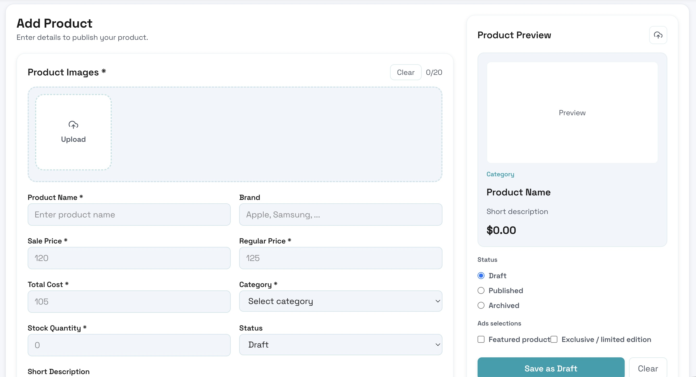
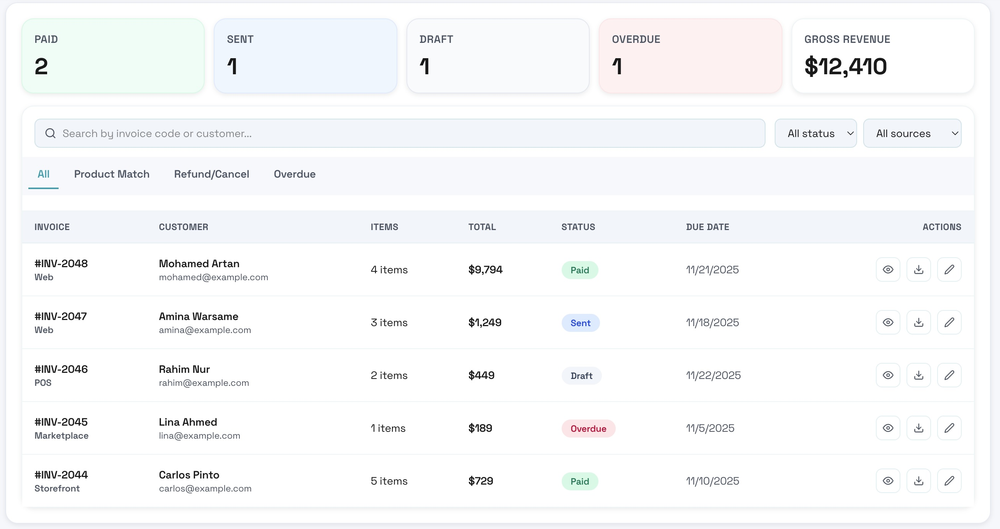

# Unimall — Full-Stack E-Commerce & Business Management Platform

Unimall is a full-stack web application designed to help small and medium-sized businesses manage products, orders, customers, and sales through a single centralized system, while also providing customers with a modern online shopping experience.

---

## 🧩 Problem Statement

Many small businesses rely on manual processes or disconnected tools to manage inventory, orders, and customers. This often leads to stock inconsistencies, slow order processing, poor visibility of sales performance, and inefficient daily operations. Existing platforms are frequently complex, expensive, or not optimized for simple internal business workflows.

---

## 💡 Solution

Unimall provides a centralized business dashboard that allows store owners to manage inventory, process orders, track customers, and generate invoices in real time. The system automatically updates stock levels after purchases, maintains order lifecycle statuses, and provides customers with a clean interface to browse products and track their orders. The application focuses on operational efficiency and real-world business workflows.

---

## 🎯 Why I Built This Project

I built Unimall based on my experience working with student consultancy and business environments where many organizations relied on spreadsheets and manual tracking for daily operations. I wanted to simulate a real production-style system that combines customer-facing e-commerce features with internal business management tools. The goal was to design an application that reflects real business workflows such as inventory control, order processing, invoicing, and admin management instead of building a simple CRUD demo project.

---

## ✨ Key Features

- Role-based authentication (Admin & Customer)
- Product and inventory management
- Order lifecycle management (Pending, Preparing, In Transit, Delivered, Returns)
- Shopping cart and multi-step checkout flow
- Automatic stock updates
- Invoice generation and management
- Admin dashboard with sales overview
- Secure API access using JWT and HttpOnly cookies
- Responsive and consistent UI design

---

## 🛠️ Tech Stack

### Frontend

- React
- Tailwind CSS
- Vite

### Backend

- Node.js
- Express.js
- MongoDB (Mongoose)

### Authentication & Security

- JWT Authentication
- HttpOnly Cookies
- Protected Routes
- Role-Based Access Control

### Media & Email

- Cloudinary
- SendGrid

---

## 🏗️ System Architecture

- Separate public storefront and admin dashboard
- REST API with centralized order and inventory handling
- Modular backend structure (controllers, routes, middleware)
- Environment-based configuration for production deployment

---

## 📸 Application Screenshots

### Public Interface

1. Checkout Flow  
   Shows multi-step checkout process with dynamic pricing, tax calculation, and order summary.  
   

2. Customer Orders Tracking  
   Displays order history and real-time order status progression.  
   

3. Product Listing Page  
   Shows filtering, pagination, and product browsing experience.  
   

---

### Admin Dashboard

4. Orders Management Panel  
   Central dashboard for managing order lifecycle and fulfillment statuses.  
   

5. Quick Order Edit Panel  
   Allows admins to update order status and payment state in real time.  
   

6. Inventory Management (Product List)  
   Displays stock levels, pricing, visibility status, and product controls.  
   

7. Add Product Form  
   Admin interface for adding new products with image upload and validation.  
   

8. Invoices Management  
   Shows invoice generation, payment status tracking, and downloadable records.  
   

---

## 🔐 Security Considerations

- JWT authentication with HttpOnly cookies
- Role-based access for admin functionality
- Protected API endpoints
- Input validation and restricted sensitive actions

---

## 📚 What I Learned

- Designing scalable full-stack architecture
- Managing frontend and backend state synchronization
- Implementing secure authentication flows
- Handling real business workflows such as order processing and inventory control
- Structuring production-style REST APIs

---

## ⚠️ Known Limitations (Design Scope)

- Payment gateway integration is mocked to focus on order workflow and backend architecture
- Single-business configuration (multi-tenant support planned)
- Limited advanced analytics

---

## 🚀 Future Improvements

- Payment gateway integration (Stripe)
- Multi-store (multi-tenant) support
- Advanced analytics and reporting
- POS module full implementation
- Notification system enhancements

---

## 🌐 Live Demo

Storefront: https://unimall-wine.vercel.app/  
Admin Panel: https://unimall-wine.vercel.app/cpanel

---

## 📂 Project Structure

```
Unimall/
  backend/
  frontend/
```

---

## ⚙️ Installation

### Backend

```
cd backend
npm install
npm run dev
```

### Frontend

```
cd frontend
npm install
npm run dev
```

---

## 🧪 Admin Seed

```
cd backend
npm run seed:admin
```

---

## 📄 License

MIT
